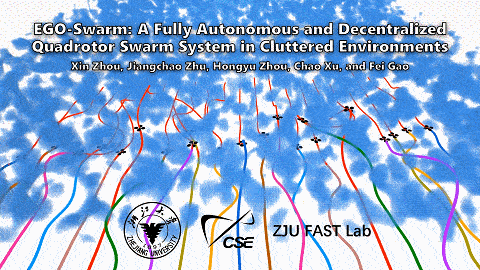
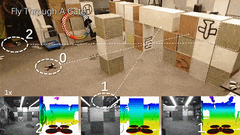

# Quick Start within 3 Minutes 
Compiling tests passed on ubuntu **16.04, 18.04 and 20.04** with ros installed.
You can just execute the following commands one by one.
```
sudo apt-get install libarmadillo-dev
git clone https://github.com/ZJU-FAST-Lab/ego-planner-swarm.git
cd ego-planner-swarm
catkin_make -j1
source devel/setup.bash
roslaunch ego_planner simple_run.launch
```
<!If your network to github is slow, We recommend you to try the gitee repository [https://gitee.com/iszhouxin/ego-planner-swarm](https://gitee.com/iszhouxin/ego-planner-swarm). They synchronize automatically./>

If you find this work useful or interesting, please kindly give us a star :star:, thanks!:grinning:

# Acknowledgements

- This work extends [EGO-Planner](https://github.com/ZJU-FAST-Lab/ego-planner) to swarm navigation.

# EGO-Swarm
EGO-Swarm: A Fully Autonomous and Decentralized Quadrotor Swarm System in Cluttered Environments

**EGO-Swarm** is a decentralized and asynchronous systematic solution for multi-robot autonomous navigation in unknown obstacle-rich scenes using merely onboard resources.

<p align = "center">




</p>

**Video Links:** [YouTube](https://www.youtube.com/watch?v=K5WKg8meb94&ab_channel=FeiGao), [bilibili](https://www.bilibili.com/video/BV1Nt4y1e7KD) (for Mainland China)

## 1. Related Paper
EGO-Swarm: A Fully Autonomous and Decentralized Quadrotor Swarm System in Cluttered Environments, Xin Zhou, Jiangchao Zhu, Hongyu Zhou, Chao Xu, and Fei Gao (Accepted by ICRA2021). [Preprint](https://arxiv.org/abs/2011.04183v1), [Science report](https://www.sciencemag.org/news/2020/12/watch-swarm-drones-fly-through-heavy-forest-while-staying-formation).

## 2. Standard Compilation

**Requirements**: ubuntu 16.04, 18.04 or 20.04 with ros-desktop-full installation.

**Step 1**. Install [Armadillo](http://arma.sourceforge.net/), which is required by **uav_simulator**.
```
sudo apt-get install libarmadillo-dev
``` 

**Step 2**. Clone the code from github or gitee. This two repositories synchronize automaticly.

From github,
```
git clone https://github.com/ZJU-FAST-Lab/ego-planner-swarm.git
```

<!--Or from gitee,
```
git clone https://gitee.com/iszhouxin/ego-planner-swarm.git
```
/-->

**Step 3**. Compile,
```
cd ego-planner
catkin_make -DCMAKE_BUILD_TYPE=Release -j1
```

**Step 4**. Run.

In a terminal at the _ego-planner-swarm/_ folder, open the rviz for visuallization and interactions
```
source devel/setup.bash
roslaunch ego_planner rviz.launch
```

In another terminal at the _ego-planner-swarm/_, run the planner in simulation by
```
source devel/setup.bash
roslaunch ego_planner swarm.launch
```

Then you can follow the gif below to control the drone.

<p align = "center">

</p>

## 3. Using an IDE
We recommend using [vscode](https://code.visualstudio.com/), the project file has been included in the code you have cloned, which is the _.vscode_ folder.
This folder is **hidden** by default.
Follow the steps below to configure the IDE for auto code completion & jump.
It will take 3 minutes.

**Step 1**. Install C++ and CMake extentions in vscode.

**Step 2**. Re-compile the code using command
```
catkin_make -DCMAKE_BUILD_TYPE=Release -DCMAKE_EXPORT_COMPILE_COMMANDS=Yes
```
It will export a compile commands file, which can help vscode to determine the code architecture.

**Step 3**. Launch vscode and select the _ego-planner_ folder to open.
```
code ~/<......>/ego-planner-swarm/
```

Press **Ctrl+Shift+B** in vscode to compile the code. This command is defined in _.vscode/tasks.json_.
You can add customized arguments after **"args"**. The default is **"-DCMAKE_BUILD_TYPE=Release"**.

**Step 4**. Close and re-launch vscode, you will see the vscode has already understood the code architecture and can perform auto completion & jump.

 ## 4. Use GPU or Not
 Packages in this repo, **local_sensing** have GPU, CPU two different versions. By default, they are in CPU version for better compatibility. By changing
 
 ```
 set(ENABLE_CUDA false)
 ```
 
 in the _CMakeList.txt_ in **local_sensing** packages, to
 
 ```
 set(ENABLE_CUDA true)
 ```
 
CUDA will be turned-on to generate depth images as a real depth camera does. 

Please remember to also change the 'arch' and 'code' flags in the line of 
```
    set(CUDA_NVCC_FLAGS 
      -gencode arch=compute_61,code=sm_61;
    ) 
``` 
in _CMakeList.txt_, if you encounter compiling error due to different Nvidia graphics card you use. You can check the right code [here](https://github.com/tpruvot/ccminer/wiki/Compatibility).
 
Don't forget to re-compile the code!

**local_sensing** is the simulated sensors. If ```ENABLE_CUDA``` **true**, it mimics the depth measured by stereo cameras and renders a depth image by GPU. If ```ENABLE_CUDA``` **false**, it will publish pointclouds with no ray-casting. Our local mapping module automatically selects whether depth images or pointclouds as its input.

For installation of CUDA, please go to [CUDA ToolKit](https://developer.nvidia.com/cuda-toolkit)

## 5. Use Drone Simulation Considering Dynamics or Not
Typical simulations use a dynamic model to calculate the motion of the drone under given commands.
However, it requires continous iterations to solver a differential equation, which consumes quite a lot computation.
When launching a swarm of drones, this computation burden may cause significant lag.
On an i7 9700KF CPU I use, 15 drones are the upper limit.
Therefore, for compatibility and scalability purposes, I use a "[fake_drone](https://github.com/ZJU-FAST-Lab/ego-planner-swarm/tree/master/src/uav_simulator/fake_drone)" package to convet commands to drone odometry directly by default.

If you want to use a more realistic quadrotor model, you can un-comment the node `quadrotor_simulator_so3` and `so3_control/SO3ControlNodelet` in [simulator.xml](https://github.com/ZJU-FAST-Lab/ego-planner-swarm/blob/master/src/planner/plan_manage/launch/simulator.xml) to enable quadrotor simulation considering dynamics.
Please don't forget to comment the package `poscmd_2_odom` right after the above two nodes.

## 6. Utilize the Full Performance of CPU
The computation time of our planner is too short for the OS to increase CPU frequency, which makes the computation time tend to be longer and unstable.

Therefore, we recommend you to manually set the CPU frequency to the maximum.
Firstly, install a tool by
```
sudo apt install cpufrequtils
```
Then you can set the CPU frequency to the maximum allowed by
```
sudo cpufreq-set -g performance
```
More information can be found in [http://www.thinkwiki.org/wiki/How_to_use_cpufrequtils](http://www.thinkwiki.org/wiki/How_to_use_cpufrequtils).

Note that CPU frequency may still decrease due to high temperature in high load.

<!--
# Improved ROS-RealSense Driver

We modified the ros-relasense driver to enable the laser emitter strobe every other frame, allowing the device to output high quality depth images with the help of emitter, and along with binocular images free from laser interference.

<p align = "center">

</p>

This ros-driver is modified from [https://github.com/IntelRealSense/realsense-ros](https://github.com/IntelRealSense/realsense-ros) and is compatible with librealsense2 2.30.0.
Tests are performed on Intel RealSense D435 and D435i.

Parameter ```emitter_on_off``` is to turn on/off the added function.
Note that if this function is turned on, the output frame rate from the device will be reduced to half of the frame rate you set, since the device uses half of the stream for depth estimation and the other half as binocular grayscale outputs.
What's more, parameters ```depth_fps``` and ```infra_fps``` must be identical, and ```enable_emitter``` must be true as well under this setting.

##  Install

The driver of librealsense2 2.30.0 should be installed explicitly.
On a x86 CPU, this can be performed easily within 5 minutes.
Firstly, remove the currently installed driver by 
```
sudo apt remove librealsense2-utils
```
or manually remove the files if you have installed the librealsense from source.
Then, you can install the library of version 2.30.0 by
```
sudo apt-key adv --keyserver keys.gnupg.net --recv-key F6E65AC044F831AC80A06380C8B3A55A6F3EFCDE || sudo apt-key adv --keyserver hkp://keyserver.ubuntu.com:80 --recv-key F6E65AC044F831AC80A06380C8B3A55A6F3EFCDE
```
For ubuntu 16.04
```
sudo add-apt-repository "deb http://realsense-hw-public.s3.amazonaws.com/Debian/apt-repo xenial main" -u
```
For ubuntu 18.04
```
sudo add-apt-repository "deb http://realsense-hw-public.s3.amazonaws.com/Debian/apt-repo bionic main" -u
```
Then continue with
```
sudo apt-get install librealsense2-dkms
sudo apt install librealsense2=2.30.0-0~realsense0.1693
sudo apt install librealsense2-gl=2.30.0-0~realsense0.1693
sudo apt install librealsense2-utils=2.30.0-0~realsense0.1693
sudo apt install librealsense2-dev=2.30.0-0~realsense0.1693
sudo apt remove librealsense2-udev-rules
sudo apt install librealsense2-udev-rules=2.30.0-0~realsense0.1693
``` 
Here you can varify the installation by 
```
realsense_viewer
```

##  Run

If everything looks well, you can now compile the ros-realsense package named _modified_realsense2_camera.zip_ by ```catkin_make```, then run ros realsense node by 
```
roslaunch realsense_camera rs_camera.launch
```
Then you will receive depth stream along with binocular stream together at 30Hz by default.
-->

# Licence
The source code is released under [GPLv3](http://www.gnu.org/licenses/) license.

# Maintaince
We are still working on extending the proposed system and improving code reliability. 

For any technical issues, please contact Xin Zhou (iszhouxin@zju.edu.cn) or Fei GAO (fgaoaa@zju.edu.cn).

For commercial inquiries, please contact Fei GAO (fgaoaa@zju.edu.cn).
